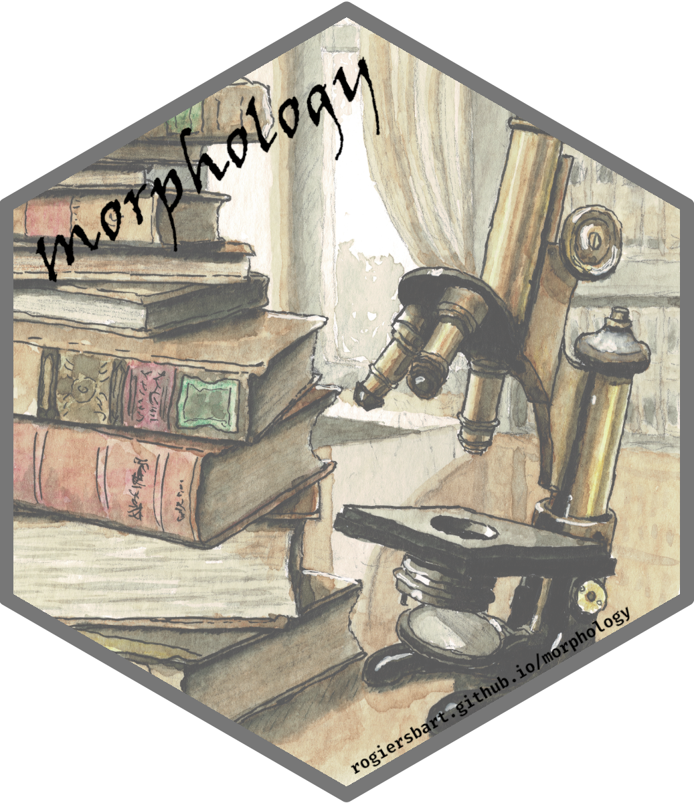

<!-- README.md is generated from README.Rmd. Please edit that file -->

```{r, include = FALSE}
knitr::opts_chunk$set(
  collapse = TRUE,
  comment = "#>",
  fig.path = "man/figures/README-",
  out.width = "100%"
)
```

# The {morphology} R package<br><small><font color="#999">Morphological description of 3D categorical arrays</font></small>

<!-- badges: start -->
[](https://github.com/rogiersbart/morphology)
[](https://CRAN.R-project.org/package=morphology)
[](https://www.tidyverse.org/lifecycle/#experimental)
<!-- badges: end -->

The goal of {morphology} is to ...

## Install

You can install the latest version of {morphology} with the following:

``` r
if (!require(pak)) install.packages("pak")
pak::pak("rogiersbart/morphology")
```

## Use

The basic {morphology} workflow looks as follows:

``` r
library(morphology)
description <- my_array |>
  look_at("voxels", of_category = 1) |> 
  look_in(direction = "xyz") |>
  look_for(neighbours = 100, within = 10) |> 
  describe() |> 
  scale_by("inverse neighbourhood") |>
  finalise()
```

See [Get started](articles/morphology.html) for a more comprehensive overview.

## Note
